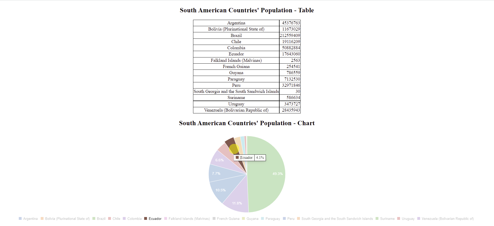

# PROG 2700 - Tech Check 4 

**Value:** 7.5% of overall course mark  
**Time to complete:** 1 hour

## HTML DOM & D3/C3

Using the data retrieved from the provided API Endpoint, filter the data for only South American countries. Then implement a function called 'drawTable' that uses either "Vanilla" JavaScript DOM manipulation or D3 to generate a table matching the one shown in the sampleOuput.png screenshot. Also, implement a function called 'drawChart' that uses C3 to generate a chart matching the one shown in the sampleOuput.png screenshot.

### Requirements

You should make use of the provided CSS file (i.e. put a class of "populationCell" on the second cell of each row so the data right aligns, make sure border lines show around your table. etc.). You will need to link in all the required D3/C3 files in the index.html file for the application to work.

### Important Note

There are no tests included with this Tech Check. Simply try to display a result similar to the following (from sampleOuput.png screenshot):

### Submission Instructions

Once your program is complete, or if you run out of in-class time to complete the Tech Check, commit and push your code to GitHub with the commit message "End of Class"

If you complete the Tech Check outside of class time, commit and push your subsequent code additions and changes with a message or "Ready for Marking"

### Marking Scheme
Final Grade | Requirement
:---: | ---
|**10/10** | Tech check is correct (matches desired output) and is completed within the allotted in-class time.
|**8/10** | Tech check is correct (matches desired output) and is completed within a 12-hour grace period beginning immediately following the end of in-class time.
|**6/10** | Tech check is correct (matches desired output) and is completed and submitted after the 12-hour grace period has elapsed.
|**0/10** | Tech check is not submitted or does not match desired output.